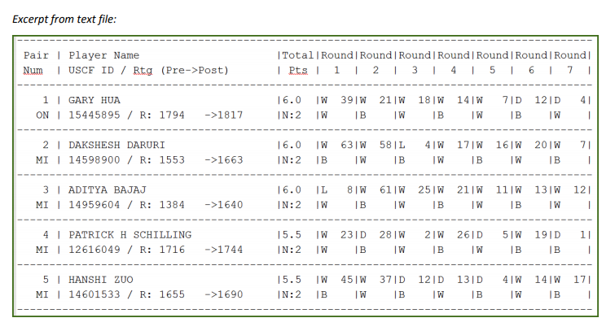

## Problem statement 

In this project, I have been given a text file with chess tournament results where the information has some structure. My job is to create an R Markdown file that generates a .CSV file (that could for example be imported into a SQL database) with the following information for all of the players:


```{r, echo=FALSE}

Pl_Name <- ("GARY HUA")
Pl_State <-("ON")
Tol_Points<-(6.0)
Pl_PreRating<- (1794)
Average_PreChessRatingOpponents<- (1605)
Player_info <- data.frame(Pl_Name, Pl_State, Tol_Points, Pl_PreRating, Average_PreChessRatingOpponents)

knitr::kable(Player_info, "pipe",col.names = c("Player's Name", "Player's State", "Total Number of Points", "Player's Pre-Rating", "Average Pre-Chess Rating of Opponenets"), align = c("l", "l", "l", "l"))
```

1605 was calculated by using the pre-tournament opponents’ ratings of 1436, 1563, 1600, 1610, 1649, 1663, 1716, and dividing by the total number of games played.

### Data in Text File 

The chess tournament text file is written in a format that is not legible in R. This file needs to be re-structured in order to find the average pre-tournament score.




### Packages:
* Stringr

* Tydyverse

* Dplryr

```{r, echo=FALSE, results= "hide", warning=FALSE, message=FALSE}

library(stringr)
library(tidyverse)
library(dplyr)

```


### Key Methods

*Using Github URL*

https://raw.githubusercontent.com/mgino11/Cleanup_txt_str/main/tournamentinfo.txt

We will perfom a series of methods using the Stringr package Some of the functions used where str_split, str_extract_all.

* Skip the Headers and get the data
* Remove the Dash-lines 
* Extraction of Columns using Regular Epressions 
  * Obtain Players Names 
  * Get the players States
  * Get the total number of Points
  * Get the Pre-Ratings
  * Get the Opponent Strings
  * Get the Individual Opponent into a matrix of 7 columns
  * Remove any Blank rows from the Data
  
#### *Deconstruct Data*

In this data set we already know that the first 4 lines are not part of our data because they include -- dash lines, Pair, Num, Dash lines.
in addition, we need to extract the data using sequences to be able to see data better and take direction from what we see. In this case we will divide the data in 2 matrices.

* Matrix 1 = the sequence starts at row 5 with length (chess1)
* Matrix 2 = the sequence starts at row 6 with length (chess1)


<details>
  <summary> See Code </summary>
  

```{r, warning= FALSE}
chess_data <- read.csv(file = "https://raw.githubusercontent.com/mgino11/Cleanup_txt_str/main/tournamentinfo.txt", skip = 3, header = F)

# Create a Matrix and create a sequence
chess1 <- matrix(unlist(chess_data), byrow = TRUE)
matrix_chess1 <- chess1[seq(5, length(chess1), 3)]
head(matrix_chess1)

```
```{r}
matrix_chess2 <- chess1[seq(6,length(chess1),3)]
head(matrix_chess2)
```
  

# _________________________________________________________________________#
#### *String Manipulation and Regular Expressions*

In this section we will use Stringr to obtain the data we need to create a data frame

We will extract

* ID
* Name
* State
* Total number of Points
* Pre rating score

___________________________________________________________________________
#### Name 

<details>
  <summary> See Code </summary>

```{r}

# we will use the ID number to obtain an organized Matrix

ID <- as.numeric(str_extract(matrix_chess1, '\\d+'))

# Matching Name Characters any characters with length up to 32 char

Name <- str_extract(matrix_chess1, '[A-z].{1,32}')
head(Name)

# Extract Name - we get rid of white space 
Name <- str_trim(str_extract(Name, '.+\\s{2,}'))
head(Name)

```
# _________________________________________________________________________#
#### State


<details>
  <summary> See Code </summary>

```{r}
# Matrix chess 2 is the one that contains the information for state
# We are asking to extract range of characters from A-Z with length of 2 char
state <- str_extract(matrix_chess2, '[A-Z]{2}')
head(state)
```
# _________________________________________________________________________#
#### Total Points 


<details>
  <summary> See Code </summary>

  
  
```{r}
# First we need to match the total points format 6.0 number followed by a period and a number
total_points <- as.numeric(str_extract(matrix_chess1, '\\d+\\.\\d'))
total_points
```
# _________________________________________________________________________#
#### Pre Ratings 

<details>
  <summary> See Code </summary>
  
```{r}
# First we need to Match the combination of "R" and the characters before (-) that information will be  Matrix # 2
pre_rating <- str_extract(matrix_chess2, 'R:.{8,}-')
head(pre_rating)
```
```{r}
# now that we have located the data we need to match and extract 
pre_rating <- as.numeric(str_extract(pre_rating, '\\d{1,4}'))
head(pre_rating)
```
# _________________________________________________________________________#
#### Average Pre Chess Ratings 

<details>
  <summary> See Code </summary>

1605 was calculated by using the pre-tournament opponents’ ratings of 1436, 1563, 1600, 1610, 1649, 1663, 1716, and dividing by the total number of games played.


```{r}
# Match for all combinations of 1 capital letter and 2 spaces  and all numbers after it
round_opponent <- str_extract(matrix_chess1, '[A-Z]\\s{2,}\\d+')
head(round_opponent)

round_opponent <- as.numeric(str_extract(round_opponent, '\\d+'))
head(round_opponent)
```
I will use a loop to calculate the Average 

```{r}
average <- c()

for(i in c(1:length(round_opponent))) {
  average[i] <- round(mean(pre_rating[as.numeric(round_opponent[[i]])]),0)
  
}

head(average)

```
# _________________________________________________________________________#
#### Data Frame to .csv
<details>
  <summary> See Code </summary>
  
```{r}
Project1_DT607 <- data.frame(ID, Name, state, total_points, pre_rating,average)
head(Project1_DT607)
```

# _________________________________________________________________________#
#### Solution

```{r, echo=FALSE,warning=FALSE, message=FALSE}
knitr::kable(Project1_DT607, "pipe",col.names = c("ID", "Player's Name", "Player's State", "Total Number of Points", "Player's Pre-Rating", "Average Pre-Chess Rating of Opponenets"), align = c("l", "l", "l", "l","l"))

```

# _________________________________________________________________________#
#### Data Frame to .CSV
```{r}
write.csv(Project1_DT607, "Project1.csv")
```

